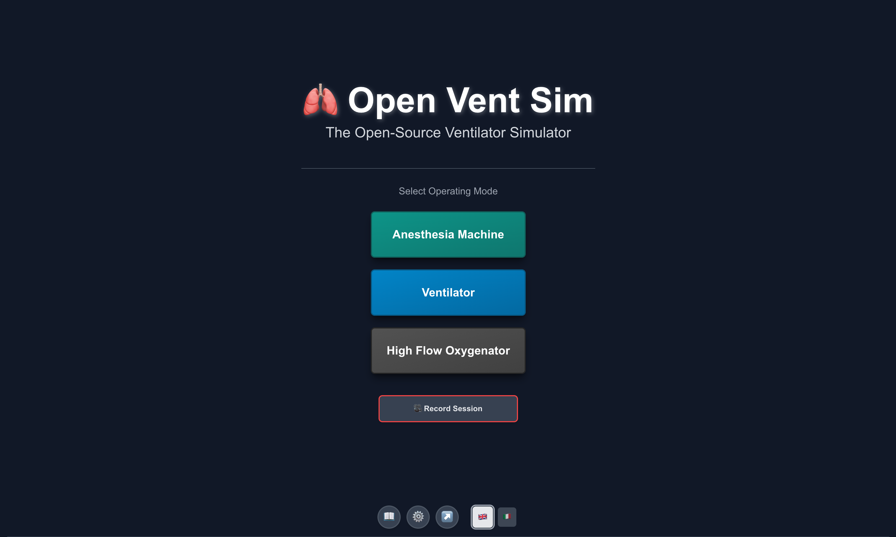
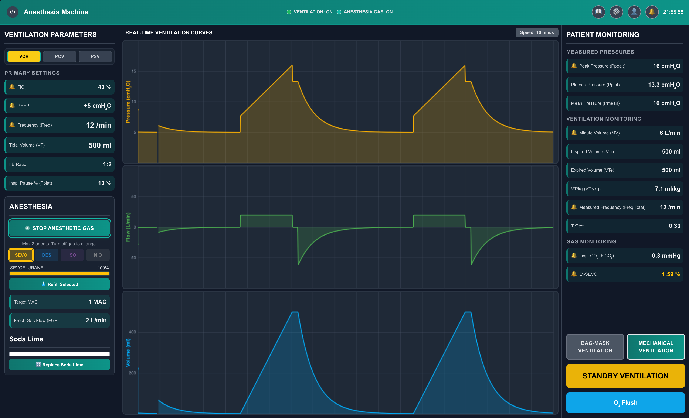
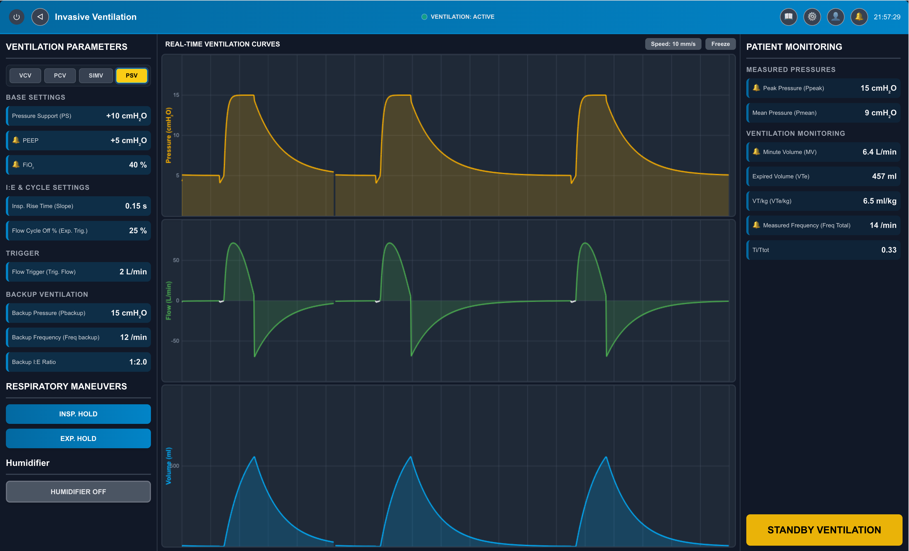

# Open Vent Sim

A high-fidelity, open-source mechanical ventilation and anesthesia machine simulator for medical education, created using Natural Language-Driven Development (NLDD).

🔗 **Live Demo**: [Try Open Vent Sim](https://open-vent-sim-960129675752.us-west1.run.app/)

## 🎯 Overview

Open Vent Sim is a web-based simulation platform that provides realistic, dynamically generated ventilation waveforms responding accurately to changes in both ventilator settings and patient physiology. Developed by clinicians for clinicians, this tool addresses the need for accessible, cost-effective ventilator training without requiring physical equipment.

<p align="center">
  
</p>
 
### Three Operating Modes

- **🏥 Anesthesia Machine**: Complete anesthesia workstation with gas delivery, vaporizers, and manual/mechanical ventilation
- **🏥 ICU Ventilator**: Advanced mechanical ventilation with invasive and non-invasive capabilities
- **💨 High Flow Oxygenator**: High Flow Nasal Cannula (HFNC) oxygen therapy simulation

### Key Features

- **🫁 High-Fidelity Waveforms**: Mathematically modeled pressure, volume, and flow tracings
- **👥 Patient Physiology Presets**: Normal, COPD, ARDS, Obesity profiles with realistic compliance/resistance
- **📊 Real-Time Monitoring**: Ppeak, Pplat, Pmean, volumes, compliance, resistance, gas concentrations
- **🎓 Educational Tools**: Session recording, instructor settings, scenario configuration
- **🔔 Comprehensive Alarms**: Configurable limits for all critical parameters
- **💻 Zero Installation**: Runs entirely in the browser

## 🚀 Getting Started

### Quick Start

```bash
# Clone the repository
git clone https://github.com/fedebarra/open-vent-sim.git
cd open-vent-sim

# Install dependencies
npm install

# Set the `GEMINI_API_KEY` in [.env.local](.env.local) to your Gemini API key

# Start development server
npm run dev
```

Visit `http://localhost:3000` to see the application running.

### System Requirements

- Node.js 14.0 or higher
- Modern web browser (Chrome, Firefox, Safari, Edge)
- 4GB RAM minimum

## 💡 Features Detail

### Anesthesia Machine Mode

<p align="center">
  
</p>

- **Ventilation**: Manual (Bag-Mask) and Mechanical modes
- **Anesthetic Agents**: Sevoflurane, Desflurane, Isoflurane, Halothane
- **Gas Management**: FGF control, APL valve, agent vaporizers
- **Consumables**: Agent fill levels, soda lime monitoring
- **Safety Features**: O₂ flush, Power-On Self-Test (POST)

### ICU Ventilator Mode

<p align="center">
   
</p>

- **Ventilation Modes**: 
  - Volume Control (VCV)
  - Pressure Control (PCV)
  - Synchronized Intermittent Mandatory Ventilation (SIMV)
  - Pressure Support Ventilation (PSV)
  - Continuous Positive Airway Pressure (CPAP)
- **Sub-modes**: Invasive and Non-Invasive ventilation
- **Respiratory Maneuvers**: Inspiratory/Expiratory holds
- **Advanced Monitoring**: Compliance, resistance, leak percentage (NIV)

### High Flow Oxygenator Mode

<p align="center">
  
</p>

- **Parameters**: Flow rate (up to 60 L/min), FiO₂, temperature
- **Integrated Humidification**: Water level and temperature monitoring
- **Visual Animation**: Real-time flow representation

### Waveform Engine
- **Mathematical Modeling**: Realistic waveform generation based on:
  - Patient compliance and resistance
  - Inspiratory effort strength
  - Mode-specific patterns (square wave for VCV, decelerating flow for PSV)
- **Interactive Features**: 
  - Freeze display for detailed analysis
  - Adjustable sweep speeds (10, 25, 50 mm/s)
  - Auto-scaling vertical axes

### Educational Features
- **🔴 Session Recording**: Log all events for debriefing
- **⚙️ Instructor Settings**:

<p align="center">
  
</p>

  - Pre-configure patient profiles
  - Set default parameters
  - Create specific scenarios
  - Manage POST records
- **Patient Profiles**: Customizable demographics and physiology

## 🛠️ Technical Stack

- **Frontend Framework**: React with TypeScript
- **Styling**: Tailwind CSS
- **State Management**: React Context API
- **Charts**: Custom waveform rendering engine
- **Build Tool**: Vite
- **Deployment**: Docker-ready, Google Cloud Run

## 📦 Installation

### Development Setup

1. **Clone the repository**
   ```bash
   git clone https://github.com/fedebarra/open-vent-sim.git
   cd open-vent-sim
   ```

2. **Install dependencies**
   ```bash
   npm install
   # or
   yarn install
   ```

3. **Start development server**
   ```bash
   npm run dev
   # or
   yarn dev
   ```

4. **Build for production**
   ```bash
   npm run build
   # or
   yarn build
   ```

### Docker Installation

```bash
# Build the Docker image
docker build -t open-vent-sim .

# Run the container
docker run -p 3000:3000 open-vent-sim
```

## 🚢 Deployment


### Google Cloud Run (Current Deployment)
```bash
# Build and deploy
gcloud builds submit --tag gcr.io/PROJECT-ID/open-vent-sim
gcloud run deploy --image gcr.io/PROJECT-ID/open-vent-sim --platform managed
```

### Manual Deployment

1. Build the project: `npm run build`
2. Deploy the `dist` folder to any static hosting service
3. Configure your web server to serve `index.html` for all routes

## 🎓 For Educators

### Creating Scenarios
1. Access Simulator Settings (⚙️) on startup
2. Configure patient profiles with specific physiology
3. Set default ventilator parameters
4. Save configurations for consistent training sessions

### Session Management
- Enable session recording for comprehensive debriefing
- Export event logs for analysis
- Review student interactions and parameter changes

## 📄 License

This project is licensed under the MIT License - see the [LICENSE](LICENSE) file for details.

## 🙏 Acknowledgments

- Developed at Università del Piemonte Orientale, Novara, Italy
- Clinical team: F.L. Barra MD, E. Moro MD, L. Carenzo MD, A. Costa MD, G. Rodella RN, R. Vaschetto MD PhD
- Technical facilitators: S. Ricci PhD, J. Travenec MSc
- All the Anesthesiology residents who provided invaluable feedback


## 📞 Support

- **🐛 Bug Reports**: [GitHub Issues](https://github.com/fedebarra/open-vent-sim/issues)
- **💬 Discussions**: [GitHub Discussions](https://github.com/fedebarra/open-vent-sim/discussions)
- **📧 Email**: federico.barra@med.uniupo.it
- **🔗 Live Demo**: [https://open-vent-sim-960129675752.us-west1.run.app/](https://open-vent-sim-960129675752.us-west1.run.app/)

## ⚠️ Disclaimer

**IMPORTANT**: This simulator is for educational and illustrative purposes ONLY. It is NOT a medical device and should NOT be used for clinical decision-making, patient care, or any real-world medical application. Always refer to actual medical equipment and professional guidance for clinical practice.

## 📊 Project Status


## 🎯 Roadmap

- [ ] Multi-language support (Spanish, French, German)
- [ ] Advanced scenario library with clinical cases
- [ ] Student performance analytics
- [ ] Collaborative multi-user sessions
- [ ] Mobile app development

